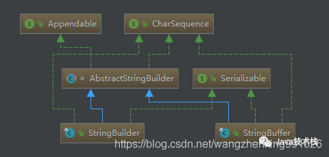
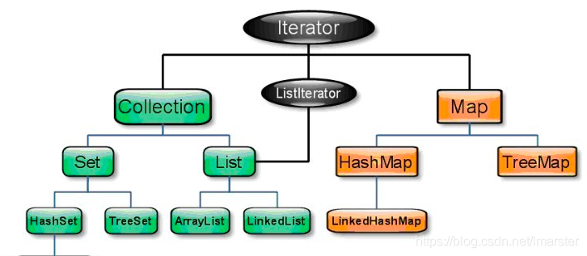

# Java的基本数据类型包括以下8种：

>byte：1字节，范围为-128到127  
short：2字节，范围为-32768到32767  
int：4字节，范围为-2147483648到2147483647  
long：8字节，范围为-9223372036854775808到9223372036854775807  
float：4字节，范围为-3.4028235E38到3.4028235E38，精度为6-7位小数  
double：8字节，范围为-1.7976931348623157E308到1.7976931348623157E308，精度为15-16位小数  
char：2字节，表示一个16位的Unicode字符，范围为�到￿  
boolean：1位，表示true或false  
这些基本数据类型都有对应的包装类，例如Byte、Short、Integer、Long、Float、Double、Character、Boolean，可以用于装箱和拆箱操作。

# java 三大特性
> 封装:

```text
在Java中，封装是一种面向对象编程的核心原则，它允许将数据和方法组合在一个类中，并限制外部代码对这些数据和方法的直接访问。通过封装，数据和方法可以更好地被控制和保护，同时也可以使代码更加可维护和可扩展。

在Java中，封装可以通过以下几种方式来实现：

访问修饰符：Java中有四个访问修饰符，分别是public、protected、default和private。使用这些修饰符可以控制类、变量和方法的可见性，从而限制外部代码对其的访问。

getter和setter方法：getter和setter方法是一种用于访问和修改私有变量的方法。它们允许变量的值被间接地访问和修改，同时还可以在访问和修改变量的过程中进行一些逻辑处理和验证。

final关键字：在Java中，final关键字可以用于修饰类、变量和方法。使用final关键字可以防止类被继承、变量被修改和方法被重写，从而增强代码的安全性和稳定性。
```

> 继承  
> 多态 多态是同一个行为具有多个不同表现形式或形态的能力。

# Java中接口和抽象类都是用来实现多态性的机制，但它们有以下几个区别：

实现方式：接口只能定义方法的签名，不能实现方法；而抽象类可以定义抽象方法和具体方法。

继承：类只能继承一个抽象类，但可以实现多个接口。

访问修饰符：接口中的方法默认为public，而抽象类中的方法可以有任意访问修饰符。

构造器：抽象类可以有构造器，而接口不能有构造器。

变量：接口中只能定义常量，即public static final类型的变量；而抽象类中可以定义任意类型的变量。

实现：实现接口的类必须实现接口中定义的所有方法，而继承抽象类的子类可以不实现抽象方法。

总的来说，接口更加抽象、纯粹，用来定义一种行为规范；抽象类更接近于实现，用来封装一些通用功能。在设计时，应该根据具体的需求来选择使用接口还是抽象类。





# Set和List的区别

> 1. Set 接口实例存储的是无序的，不重复的数据。List 接口实例存储的是有序的，可以重复的元素。  
> 2. Set 检索效率低下，删除和插入效率高，插入和删除不会引起元素位置改变 <实现类有HashSet,TreeSet>。  
> 3. List 和数组类似，可以动态增长，根据实际存储的数据的长度自动增长 List 的长度。查找元素效率高，插入删除效率低，因为会引起其他元素位置改变 <实现类有ArrayList,LinkedList,Vector> 。

# Java中集合ArrayList和LinkList的区别
Java中的ArrayList和LinkedList都是集合框架中的List接口的实现类，它们的主要区别在于内部的数据结构和操作效率。

内部数据结构
ArrayList是基于动态数组实现的，它的内部是一个数组来保存数据。由于数组具有连续存储的特点，因此ArrayList的随机访问和修改操作非常高效，时间复杂度为O(1)。但是，由于数组的长度是固定的，因此在添加或删除元素时需要进行数组扩容和拷贝，这个过程比较耗时，时间复杂度为O(n)。

LinkedList是基于双向链表实现的，它的内部是一个链表来保存数据。由于链表可以动态分配内存，因此在添加或删除元素时非常高效，时间复杂度为O(1)。但是，由于链表的节点不是连续存储的，因此随机访问和修改操作的效率比ArrayList要低，时间复杂度为O(n)。

操作效率
ArrayList的随机访问和修改操作非常高效，但是在插入或删除元素时效率比较低。在插入或删除元素时，需要移动数组的一部分元素，这个过程比较耗时。

LinkedList的插入或删除元素时效率非常高，但是在随机访问和修改元素时效率比较低。在随机访问和修改元素时，需要遍历链表找到对应的节点，这个过程比较耗时。

综上所述，如果需要进行随机访问和修改操作的话，应该使用ArrayList；，如果需要进行插入或删除操作的话应该使用LinkedList。

# 请问StringBuffer和StringBuilder有什么区别？

> StringBuffer和StringBuiler都继承自AbstractStringBuilder类  
> StringBuffer：线程安全，StringBuilder：线程不安全。因为 StringBuffer 的所有公开方法都是 synchronized 修饰的，而 StringBuilder 并没有 synchronized 修饰。  
> 既然 StringBuffer 是线程安全的，它的所有公开方法都是同步的，StringBuilder 是没有对方法加锁同步的，所以毫无疑问，StringBuilder 的性能要远大于 StringBuffer。


# 什么是HaspMap和Map？

> Map是接口，Java 集合框架中一部分，用于存储键值对，---> Map接口不是Collection接口的继承，而是从自己的用于维护键值对关联的接口层次结构入手，按定义，该接口描述了从不重复的键到值的映射。  
> HashMap是用哈希算法实现Map的类.---> HashMap类继承了AbstractMap类并实现了Map接口，HashMap是Java中的一个集合类，用于存储键值对。HashMap允许null值和null键，并且不保证元素的顺序。


。它是一种哈希表的实现，通过哈希函数将键映射到存储桶中，并提供O(1)时间复杂度的插入和查询操作。它是线程不安全的，但可以通过使用Collections.synchronizedMap()方法或使用ConcurrentHashMap类来实现多线程安全。HashMap的常用方法包括put()，get()，remove()，size()等。

# HashMap与HashTable有什么区别？对比Hashtable VS HashMap

两者都是用key-value方式获取数据。Hashtable是原始集合类之一（也称作遗留类）。HashMap作为新集合框架的一部分在Java2的1.2版本中加入。它们之间有一下区别：

● HashMap和Hashtable大致是等同的，除了非同步和空值（HashMap允许null值作为key和value，而Hashtable不可以）。

● HashMap没法保证映射的顺序一直不变，但是作为HashMap的子类LinkedHashMap，如果想要预知的顺序迭代（默认按照插入顺序），你可以很轻易的置换为HashMap，如果使用Hashtable就没那么容易了。

● HashMap不是同步的，而Hashtable是同步的。

● 迭代HashMap采用快速失败机制，而Hashtable不是，所以这是设计的考虑点。

# 什么时候使用Hashtable，什么时候使用HashMap

基本的不同点是Hashtable同步HashMap不是的，所以无论什么时候有多个线程访问相同实例的可能时，就应该使用Hashtable，反之使用HashMap。非线程安全的数据结构能带来更好的性能。


# 消息中间件有哪些

> 常见的消息中间件有 RabbitMQ、Kafka、ActiveMQ、RocketMQ 等，它们的特点如下：

> RabbitMQ：主要特点为高可靠性、高可用性、可扩展性强、易于部署和管理，采用 AMQP 协议，支持多种编程语言。

> Kafka：主要特点为高吞吐量、低延迟、可扩展性强、可靠性高、支持多种消费者群组，适用于大数据处理场景。

> ActiveMQ：主要特点为高可用性、多种传输协议支持（如TCP、UDP、AMQP、STOMP等）、消息持久化和分布式事务支持，但性能相对较低。

> RocketMQ：主要特点为高吞吐量、低延迟、可靠性高、可扩展性强、支持消息轨迹和定时消息等高级特性。